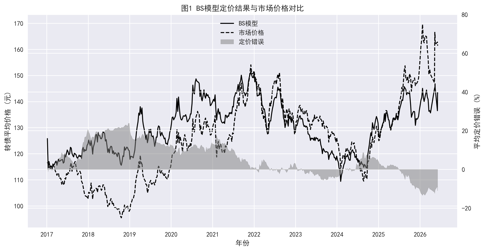
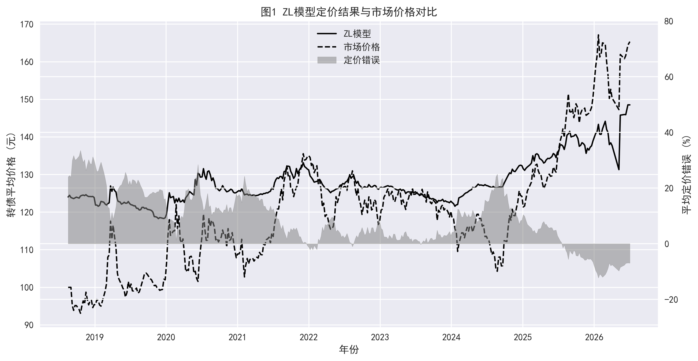

# 中国市场可转债定价模型研究 | Convertible Bond Pricing Research (China Market)

<p align="center">
  <a href="#简体中文"></a>
  &nbsp;
  <a href="#english-version"></a>
</p>

<p align="center">
  
  
  
  
</p>

---

<a id="简体中文"></a>

## 简体中文

**当前语言：中文 | [Switch to English](#english-version)**

👉 快速了解研究结论：[核心发现](summary/key_findings.md) · [完整报告](report/CB_pricing_full.pdf)

---

## 项目概述

- 本项目以 **Black-Scholes（BS）** 与 **郑-林（ZL）** 为双重绝对定价锚，研究中国 A 股可转债。
- 研究链路覆盖真实市场数据、理论定价、错误定价因子、横截面组合与自动化发布。
- 核心目标是识别市场价格相对理论价值的偏离，并检验其能否形成可解释、可交易的 Alpha。

---

## 论文来源

- 主要参考论文：《中国可转债定价模型比较研究》（郑振龙、兰添晟、陈蓉）。
- DOI：[10.13821/j.cnki.ceq.2025.01.11](https://doi.org/10.13821/j.cnki.ceq.2025.01.11)。
- 核心思路：同时从定价误差与多空组合 Alpha 两个维度比较多种可转债定价模型。
- 本仓库在 [`report/`](report/) 提供完整报告，便于核对模型假设、参数设定与实证细节。

---

## 仓库框架

本仓库按研究流程组织，从模型定价到因子构建，再到组合回测。

```text
Convertible-Bond-Pricing-Research/
├─ .github/workflows/       #  远端严格增量周更新与研究产物发布
├─ backtest/                #  BS 与 ZL 定价回测主程序 + 数据管道
│   ├─ data_pipeline.py     #  Tushare 数据管道；日常按 Manifest 边界增量运行
│   ├─ B-S_backtest.py      #  Black-Scholes 周度定价
│   ├─ Z-L_backtest_GPU_prod.py # 郑-林 Monte Carlo 定价（CUDA/CPU 共用驱动）
│   ├─ Z-L_backtest_CPU_prod.py # GitHub Actions CPU 增量入口
│   └─ full_history_rebuild.py  # GPU 门控的一键全历史重建
├─ mispricing factor/       #  错误定价因子与相关性分析
├─ long-short strategy/     #  横截面多空策略与绩效输出
├─ summary/                 #  面试优先阅读精简总结
├─ report/                  #  完整研究报告（PDF）
├─ AGENTS.md                #  代码导航、数据契约与运行约束
└─ README.md                #  项目总览与方法框架
```

建议阅读顺序：

1. [`summary/key_findings.md`](summary/key_findings.md)
2. [`README.md`](README.md)
3. [`report/CB_pricing_full.pdf`](report/CB_pricing_full.pdf)

---

## 核心标签

- 可转债定价
- 绝对估值
- 错误定价 Alpha
- 多因子融合
- 横截面多空策略
- 蒙特卡洛路径依赖定价

---

## 研究动机

在当前中国可转债市场中：

- 高估值与拥挤交易导致价格扭曲。
- 相对估值指标（如转股溢价率）失效。
- 条款复杂且路径依赖显著。

→ 需要构建统一的**绝对定价锚**。

---

## 定价框架

### 可转债价值拆解

$$
V_{CB} = V_{bond} + V_{option}
$$

- 债券部分：未来现金流贴现。
- 期权部分：嵌入的转股期权。

---

## 模型设计

### 🔹 Black-Scholes Model (BS)

定价逻辑：

$$
V_{option} = S e^{-qT} N(d_1) - X e^{-rT} N(d_2)
$$

- 在股价对数正态假设下的解析解模型。
- 未显式考虑路径依赖条款。

核心特征：

- 对正股价格与波动率高度敏感。
- 无赎回约束时，上行空间不受限。

→ 属于**进攻型定价锚**。

---

### 🔹 Zheng-Lin Model (ZL)

定价逻辑：

基于最优停止思想的蒙特卡洛模拟。

1. 模拟正股价格路径。
2. 评估赎回/回售/下修条款触发。
3. 对预期现金流折现。

模型来源与机制：

- ZL 延续二叉树模型的无套利与风险中性定价思想，但将简单的“上涨/下跌”节点扩展为含赎回、回售、下修和转股的动态决策问题。
- 本项目以蒙特卡洛路径承载发行人与投资者的条款博弈，在每条路径上评估触发条件、最优响应与折现现金流。
- 相比 BS 的静态闭式解，ZL 更适合刻画强路径依赖和非线性条款约束，因此被定位为偏防守的定价锚。

核心特征：

- 全路径依赖，条款刻画更完整。
- 能刻画强赎上限与下修凸性。
- 估值相对更保守。

→ 属于**防守型定价锚**。

---

### 模型误差对比

| Error Metric           | BS     | ZL     |
| ---------------------- | ------ | ------ |
| Mean Error (Bias, CNY) | 2.50   | -12.85 |
| MAE (CNY)              | 14.09  | 14.48  |
| RMSE (CNY)             | 31.14  | 33.70  |
| MAPE                   | 9.76%  | 9.49%  |
| SMAPE                  | 9.69%  | 10.39% |

MAE/MAPE/SMAPE 越低，模型定价拟合效果越好。

> **口径与时点**：理论价与市场价按相同「交易日 × 转债」单元严格对齐（BS n=149,694；ZL n=138,820），MAPE 排除市场价为零的单元。周度样本更新至 **2026-08-28**。ZL 最新增量由 CUDA 生产入口计算；常规更新只处理 Manifest 截止日之后的新交易周，不回算已验证历史。

---

## 数据基础设施

### 自动化数据管道

`backtest/data_pipeline.py` 通过 **Tushare Pro API** 替代了原有的手动 Excel 维护流程，支持全量历史拉取与每日增量更新。

| 数据字段 | Tushare 接口 |
|----------|-------------|
| 可转债收盘价 | `pro.cb_daily(fields='close')` |
| 转换价值 | `pro.cb_daily(fields='convert_val')` |
| 可转债涨跌幅 | 优先使用源字段；缺失时按相邻收盘价手动计算，并以免费行情源校正 |
| 剩余期限 | `pro.cb_basic()` 到期日推算 |
| 正股总市值 | `pro.daily_basic(fields='total_mv')` |
| 信用评级 | `pro.rating(bond_type='CB')` |
| 每股净资产 | `pro.fina_indicator(fields='bps')` |
| 无风险利率 | Akshare 国债收益率曲线 |
| 纯债价值 | DCF 现金流折现（内置计算） |

所有输出以宽表 CSV 缓存（行=日期，列=转债代码）。常规周更新从 `ZL_Model_Manifest.json` 读取已验证截止日，只拉取、定价并发布其后的新增交易周；全历史重建仅用于显式维护，不属于日常更新路径。

远端周度更新计划：

| 环节 | 计划与门控 |
|------|------------|
| 定时触发 | GitHub Actions 每周五 17:30（北京时间）运行，也支持手动触发 |
| 交易日口径 | 仅发布该 `W-FRI` 周内最后一个真实交易日；周五休市时自动保留此前最近交易日 |
| 数据门控 | `TUSHARE_TOKEN`、真实源覆盖率、BS 覆盖率与基准日期任一不满足即停止 |
| 执行链路 | GitHub 增量更新真实数据与 BS → CPU 增量更新 ZL → 更新基准、因子、策略与图表 |
| 发布边界 | 只在验证通过后提交产物；并发运行不互相取消，失败时保留上一版结果 |

> GitHub 的定时工作流只从默认分支生效。启用前需在仓库 Secrets 中配置 `TUSHARE_TOKEN`。周度 ZL 使用 CPU 增量后端，不依赖本地电脑或 CUDA；全历史重建仍建议使用 GPU。
>
> 本地目录无法在电脑关机时被物理写入。运行一次 `backtest/setup_main_sync_task.ps1` 后，电脑登录及在线期间会定期获取远端更新；仅当本地处于干净的 `main` 时才执行 fast-forward，避免覆盖未提交工作。

---

## 错误定价因子

$$
Mispricing = V_{model} - V_{market}
$$

- 正值 → 低估 → 做多。
- 负值 → 高估 → 做空。

---

## 策略构建

### 横截面多空策略

策略基于上文定义的错误定价指标（RD）构建。

- 按月调仓并在全市场按 RD 横截面排序。
- **多头组合**：RD 前 20%（低估标的）。
- **空头组合**：RD 后 20%（高估标的）。

### 交易逻辑

- 临时性错误定价的价值回归带来超额收益。
- 市场价格向理论价值收敛是核心 Alpha 来源。

---

## 回测结果

| Strategy | Annual Return | Sharpe | Max Drawdown |
| -------- | ------------- | ------ | ------------ |
| BS Long  | 19.33%        | 0.91   | -28.96%      |
| ZL Long  | 20.48%        | 0.94   | -29.75%      |

> **回测口径**：2019-01-25 至 2026-08-28，共 91 个收益观察期，月末调仓，展示扣除交易成本后的多因子等权多头组合；夏普比率使用同期观测的一年期国债收益率均值。同期中证转债基准年化收益为 7.08%。

结论摘要：BS 与 ZL 提供不同的估值视角；最新样本中 ZL 多头收益略高，但两者回撤均提示组合仍需风险预算与市场状态约束。

---

## 关键图表

### 定价误差与市场价格时序（BS / ZL）





### 多空策略表现（BS / ZL）


### 错误定价因子相关性（BS / ZL）


---

## 核心洞察

- BS 捕捉**估值扩张 + 动量**。
- ZL 捕捉**价值回归 + 下行防御**。
- 错误定价因子与传统风格因子呈显著**正交性**。

→ 两者结合为组合提供互补的进攻与防守信息。

---

## 局限性

- BS 对条款约束刻画不足。
- ZL 计算成本较高。
- 空头端在强动量市场中可能承压。

---

## 后续优化

- 事件驱动条款建模。
- 基于机器学习的概率估计。
- 动态参数校准。
- 融入多因子体系。

---

## 完整报告

完整研报见：[report/CB_pricing_full.pdf](report/CB_pricing_full.pdf)

---

## 项目贡献

- 统一的绝对定价框架。
- 可交易的错误定价信号设计。
- 完整的回测研究流程。
- 清晰区分进攻型与防守型 Alpha。

---

## 引用说明

如使用本项目框架或部分研究成果，请引用本仓库并明确说明模型假设与数据边界。

---

<a id="english-version"></a>

## English Version

**Current Language: English | [切换到中文](#简体中文)**

👉 Start here: [Key Findings](summary/key_findings.md) · [Full Report](report/CB_pricing_full.pdf)

---

## 📌 Overview

- This project studies Chinese A-share convertible bonds through two absolute pricing anchors: **Black-Scholes (BS)** and **Zheng-Lin (ZL)**.
- The research chain covers observed market data, theoretical pricing, mispricing factors, cross-sectional portfolios, and automated publication.
- The objective is to identify deviations from theoretical value and test whether they produce interpretable, tradable alpha.

---

## 📚 Paper Source

- Primary reference paper: Comparative Study on Pricing Models of Chinese Convertible Bonds (Zheng Zhenlong, Lan Tiansheng, Chen Rong).
- DOI: [10.13821/j.cnki.ceq.2025.01.11](https://doi.org/10.13821/j.cnki.ceq.2025.01.11).
- Core idea: compare multiple convertible-bond pricing models by both pricing error and long-short alpha performance.
- The [`report/`](report/) directory documents assumptions, calibration, and empirical outputs.

---

## 🗂️ Repository Structure

This repository is organized by research workflow from model pricing to factor construction and portfolio backtesting.

```text
Convertible-Bond-Pricing-Research/
├─ .github/workflows/       # Strict incremental weekly data and research-output publication
├─ backtest/                # BS and ZL pricing engines + data pipeline
│   ├─ data_pipeline.py     # Tushare pipeline; routine runs are bounded by the manifest cutoff
│   ├─ B-S_backtest.py      # Weekly Black-Scholes pricing
│   ├─ Z-L_backtest_GPU_prod.py # Shared Zheng-Lin CUDA/CPU production driver
│   ├─ Z-L_backtest_CPU_prod.py # GitHub Actions CPU incremental entrypoint
│   └─ full_history_rebuild.py  # GPU-gated full-history rebuild
├─ mispricing factor/       # Mispricing factor and correlation analysis
├─ long-short strategy/     # Cross-sectional long-short strategy outputs
├─ summary/                 # Concise summary for interview reading
├─ report/                  # Full research reports (PDF)
├─ AGENTS.md                # Code navigation, data contracts, and run constraints
└─ README.md                # Project overview and methodology
```

Suggested reading order

1. [`summary/key_findings.md`](summary/key_findings.md)
2. [`README.md`](README.md)
3. [`report/CB_pricing_full.pdf`](report/CB_pricing_full.pdf)

---

## 🏷️ Core Tags

- Convertible bond pricing
- Absolute valuation
- Mispricing alpha
- Multi-factor integration
- Cross-sectional long-short strategy
- Monte Carlo path-dependent pricing

---

## 🎯 Motivation

In the Chinese convertible bond market:

- High valuation and crowded trading distort pricing.
- Relative valuation metrics (e.g., conversion premium) become unreliable.
- Embedded clauses create strong path dependency.

→ A unified **absolute pricing anchor** is required.

---

## 🧠 Pricing Framework

### 1. Convertible Bond Decomposition

$$
V_{CB} = V_{bond} + V_{option}
$$

- Bond component: discounted cash flows.
- Option component: embedded equity call option.

---

## ⚙️ Model Design

### 🔹 Black-Scholes Model (BS)

Pricing Logic

$$
V_{option} = S e^{-qT} N(d_1) - X e^{-rT} N(d_2)
$$

- Closed-form solution under lognormal stock dynamics.
- Ignores path-dependent clauses.

Key characteristics

- High sensitivity to equity price and volatility.
- No upper bound under call-free assumption.

→ Acts as an **offensive pricing anchor**.

---

### 🔹 Zheng-Lin Model (ZL)

Pricing Logic

Monte Carlo simulation with optimal stopping.

1. Simulate stock price paths.
2. Evaluate clause triggers (Call/Put/Reset).
3. Discount expected payoff.

Model origin and mechanism

- ZL retains the no-arbitrage and risk-neutral logic of a binomial tree, while extending simple up/down nodes into a dynamic decision problem with call, put, reset, and conversion clauses.
- The implementation uses Monte Carlo paths to evaluate clause triggers, issuer-investor responses, and discounted cash flows path by path.
- Relative to the static BS closed form, ZL better represents nonlinear clause constraints and strong path dependence, so it serves as the defensive pricing anchor.

Key characteristics

- Fully path-dependent and clause-aware.
- Captures call cap and reset convexity.
- Produces more conservative valuation.

→ Acts as a **defensive anchor**.

---

### Model Error Comparison

| Error Metric           | BS     | ZL     |
| ---------------------- | ------ | ------ |
| Mean Error (Bias, CNY) | 2.50   | -12.85 |
| MAE (CNY)              | 14.09  | 14.48  |
| RMSE (CNY)             | 31.14  | 33.70  |
| MAPE                   | 9.76%  | 9.49%  |
| SMAPE                  | 9.69%  | 10.39% |

Lower MAE/MAPE/SMAPE indicates better pricing fit.

> **Scope & vintage**: theoretical and market prices are strictly aligned on identical trading-day × bond cells (BS n=149,694; ZL n=138,820), with zero-market-price cells excluded from MAPE. Weekly observations run through **2026-08-28**. The latest ZL increment was priced through the CUDA production entrypoint; routine updates process only trading weeks after the verified manifest cutoff and do not reprice certified history.

---

## 🏗️ Data Infrastructure

### Automated Data Pipeline

`backtest/data_pipeline.py` replaces the previous manual Excel workflow with a **Tushare Pro API** pipeline supporting both full historical pulls and daily incremental updates.

| Data Field | Tushare API |
|------------|-------------|
| CB closing price | `pro.cb_daily(fields='close')` |
| Conversion value | `pro.cb_daily(fields='convert_val')` |
| CB price change | Prefer the source field; otherwise calculate from adjacent closes and correct with a free quote source |
| Remaining maturity | Derived from `pro.cb_basic()` maturity date |
| Stock market cap | `pro.daily_basic(fields='total_mv')` |
| Credit rating | `pro.rating(bond_type='CB')` |
| Book value per share | `pro.fina_indicator(fields='bps')` |
| Risk-free yield curve | Akshare treasury rate data |
| Bond floor (DCF) | Computed internally from coupon + yield curve |

All outputs are cached as wide-format CSVs (rows = trade date, columns = bond code). Routine weekly runs read the verified cutoff from `ZL_Model_Manifest.json` and fetch, price, and publish only later trading weeks. Full-history rebuilds are explicit maintenance operations, not the normal update path.

Remote weekly update plan:

| Stage | Schedule and gate |
|-------|-------------------|
| Trigger | GitHub Actions runs every Friday at 17:30 Asia/Shanghai and remains manually dispatchable |
| Trading-date rule | Publish only the final observed date in each `W-FRI` week; if Friday is closed, retain the most recent open date |
| Data gates | Stop if `TUSHARE_TOKEN`, observed-source coverage, BS coverage, or benchmark freshness fails |
| Execution chain | GitHub incremental real-data + BS update → CPU incremental ZL update → benchmark, factors, strategies, and figures |
| Publication boundary | Commit only validated outputs; do not cancel an active run, and retain the previous release on failure |

> Scheduled GitHub workflows run only from the default branch and require the repository `TUSHARE_TOKEN` secret. Weekly ZL runs incrementally on CPU without a local computer or CUDA; full-history rebuilds should still use GPU compute.
>
> A powered-off computer cannot receive filesystem writes. Run `backtest/setup_main_sync_task.ps1` once to fetch updates at logon and hourly while online. The sync fast-forwards only a clean local `main`, so uncommitted work is never overwritten.

---

## 📊 Mispricing Signal

$$
Mispricing = V_{model} - V_{market}
$$

- Positive → undervalued → long.
- Negative → overvalued → short.

---

## 🚀 Strategy Design

### 🔹 Cross-sectional Long-Short Strategy

The strategy is constructed based on **mispricing (RD)** defined above.

- Monthly rebalancing and cross-sectional ranking by RD.
- **Long portfolio**: top 20% (undervalued bonds).
- **Short portfolio**: bottom 20% (overvalued bonds).

### 🔹 Trading Logic

- Mean reversion of temporary mispricing drives excess return.
- Convergence from market price to theoretical value is the core alpha source.

---

## 📈 Results

| Strategy | Annual Return | Sharpe | Max Drawdown |
| -------- | ------------- | ------ | ------------ |
| BS Long  | 19.33%        | 0.91   | -28.96%      |
| ZL Long  | 20.48%        | 0.94   | -29.75%      |

> **Backtest scope**: 2019-01-25 to 2026-08-28, 91 return observations, month-end rebalancing, and net-of-cost equal-weight multi-factor long portfolios. Sharpe ratios use the observed average one-year government-bond yield over the same window. The CSI Convertible Bond Index annualized return is 7.08% over the same period.

Summary: BS and ZL provide different valuation views. ZL delivers slightly higher long-only performance in the latest sample, while drawdowns in both portfolios show the need for explicit risk budgets and regime controls.

---

## 🖼️ Key Figures

### Pricing vs Market Time Series (BS / ZL)


### Long-Short Strategy Performance (BS / ZL)


### Mispricing Factor Correlation (BS / ZL)


---

## 🧩 Key Insight

- BS captures **valuation expansion + momentum**.
- ZL captures **mean reversion + downside protection**.
- Mispricing factor is highly **orthogonal** to traditional style factors.

→ The combination provides complementary offensive and defensive information.

---

## 📉 Limitations

- BS ignores detailed clause constraints.
- ZL is computationally expensive.
- Short leg can underperform during momentum-dominated markets.

---

## 🔮 Future Work

- Event-driven clause modeling.
- ML-based probability estimation.
- Dynamic parameter calibration.
- Integration into multi-factor system.

---

## 📎 Full Report

Full research report: [report/CB_pricing_full.pdf](report/CB_pricing_full.pdf)

---

## 🧩 Contribution

- Unified absolute pricing framework.
- Tradable mispricing signal design.
- Full backtesting pipeline.
- Clear separation of offensive vs defensive alpha.

---

## 📚 Citation

If you use this framework or part of this project, please cite the repository and state model assumptions and data boundaries clearly.
