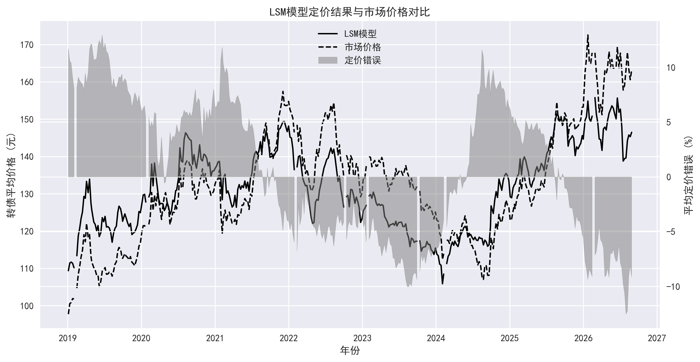

# 中国市场可转债定价模型研究 | Convertible Bond Pricing Research (China Market)

<p align="center">
  <a href="#简体中文"></a>
  &nbsp;
  <a href="#english-version"></a>
</p>

<p align="center">
  
  
  
  
</p>

---

<a id="简体中文"></a>

## 简体中文

**当前语言：中文 | [Switch to English](#english-version)**

👉 招生与面试快速阅读：[研究摘要](summary/key_findings.md) · [完整报告](report/CB_pricing_full.pdf)

---

## 项目概述

本项目研究一个具体问题。可转债的市场价格偏离理论价值时，这种偏离究竟是模型遗漏、条款影响，还是可以转化为投资信号的信息？为回答这个问题，项目在统一样本上比较 **Black-Scholes（BS）**、**郑-林（ZL）** 与 **最小二乘蒙特卡罗（LSM）**，并把模型价格接入错误定价因子和月度组合回测。

项目完整呈现了从研究假设到可复现证据的过程。数据更新、周度定价、因子构建、交易成本和结果发布均由同一套管道管理。定价误差与策略收益分别检验，避免把“拟合更准”直接等同于“投资表现更好”。

### 招生官可以快速核验的证据

| 研究能力 | 仓库中的可核验证据 |
| --- | --- |
| 模型理解 | 从闭式 BS 扩展到含条款路径的 ZL，再到继续价值回归的 LSM |
| 实证判断 | 同时比较价格误差、风险调整收益和最大回撤，不用单一指标下结论 |
| 研究工程 | 建立数据、定价、因子、回测和发布的端到端流程 |
| 可复现性 | 固定随机种子、记录输入指纹与输出哈希，日常只运行新增交易周 |

---

## 论文来源

- 主要参考论文：《中国可转债定价模型比较研究》（郑振龙、兰添晟、陈蓉）。
- LSM 方法参考：[东北证券《可转债研究框架：从理论概念到实战策略》](report/Northeast_Securities_Convertible_Bond_Research_Framework_Theory_to_Strategy_20240823.pdf)。
- DOI：[10.13821/j.cnki.ceq.2025.01.11](https://doi.org/10.13821/j.cnki.ceq.2025.01.11)。
- 核心思路：同时从定价误差与多空组合 Alpha 两个维度比较多种可转债定价模型。
- 本仓库在 [`report/`](report/) 提供完整报告，便于核对模型假设、参数设定与实证细节。

---

## 仓库框架

本仓库按研究流程组织，从模型定价到因子构建，再到组合回测。

```text
Convertible-Bond-Pricing-Research/
├─ .github/workflows/       #  远端严格增量周更新与研究产物发布
├─ backtest/                #  BS、ZL 与 LSM 定价回测主程序 + 数据管道
│   ├─ data_pipeline.py     #  Tushare 数据管道；日常按 Manifest 边界增量运行
│   ├─ B-S_backtest.py      #  Black-Scholes 周度定价
│   ├─ Z-L_backtest_GPU_prod.py # 郑-林 Monte Carlo 定价（CUDA/CPU 共用驱动）
│   ├─ Z-L_backtest_CPU_prod.py # GitHub Actions CPU 增量入口
│   ├─ LSM_backtest.py      #  LSM 向量化定价与独立增量 Manifest
│   └─ full_history_rebuild.py  # GPU 门控的一键全历史重建
├─ mispricing factor/       #  错误定价因子与相关性分析
├─ long-short strategy/     #  横截面多空策略与绩效输出
├─ summary/                 #  面试优先阅读精简总结
├─ report/                  #  完整研究报告（PDF）
├─ AGENTS.md                #  代码导航、数据契约与运行约束
└─ README.md                #  项目总览与方法框架
```

建议阅读顺序：

1. [`summary/key_findings.md`](summary/key_findings.md)
2. [`README.md`](README.md)
3. [`report/CB_pricing_full.pdf`](report/CB_pricing_full.pdf)

---

## 研究动机

中国可转债兼具债券现金流、股票期权和发行条款。转股溢价率等相对指标易受市场整体估值与拥挤交易影响，也难以单独识别赎回、回售和下修条款的价值。绝对定价模型提供了一个可比较的理论锚，但模型复杂度本身不保证更好的投资结果。本研究因此同时检验定价拟合与组合表现。

---

## 定价框架

### 可转债价值拆解

$$
V_{CB} = V_{bond} + V_{option}
$$

- 债券部分：未来现金流贴现。
- 期权部分：嵌入的转股期权。

---

## 模型设计

### 🔹 Black-Scholes Model (BS)

定价逻辑：

$$
V_{option} = S e^{-qT} N(d_1) - X e^{-rT} N(d_2)
$$

- 在股价对数正态假设下的解析解模型。
- 未显式考虑路径依赖条款。

核心特征：

- 对正股价格与波动率高度敏感。
- 无赎回约束时，上行空间不受限。

→ 属于**进攻型定价锚**。

---

### 🔹 Zheng-Lin Model (ZL)

定价逻辑：

基于最优停止思想的蒙特卡洛模拟。

1. 模拟正股价格路径。
2. 评估赎回/回售/下修条款触发。
3. 对预期现金流折现。

模型来源与机制：

- ZL 延续二叉树模型的无套利与风险中性定价思想，但将简单的“上涨/下跌”节点扩展为含赎回、回售、下修和转股的动态决策问题。
- 本项目以蒙特卡洛路径承载发行人与投资者的条款博弈，在每条路径上评估触发条件、最优响应与折现现金流。
- 相比 BS 的静态闭式解，ZL 更适合刻画强路径依赖和非线性条款约束，因此被定位为偏防守的定价锚。

核心特征：

- 全路径依赖，条款刻画更完整。
- 能刻画强赎上限与下修凸性。
- 估值相对更保守。

→ 属于**防守型定价锚**。

---

### 🔹 Least-Squares Monte Carlo Model (LSM)

定价逻辑：

1. 以转换价值为状态变量模拟风险中性路径。
2. 从到期日向前回溯，对实值路径的继续持有价值回归于 $1,S,S^2$。
3. 比较即时转股价值与估计的继续价值，得到自愿提前转股价值。
4. 最终价格取 `max(ZL 条款价值, LSM 自愿转股价值)`，避免重复加总同一转股期权。

生产参数为 256 条对偶路径、48 个行权时点、按日期固定随机种子；计算按债券批量向量化。首轮历史初始化后，`LSM_Model_Manifest.json` 会验证输入指纹和已发布工作簿哈希，日常运行只处理新增交易周。

---

### 模型误差对比

| Error Metric           | BS     | ZL     | LSM    |
| ---------------------- | ------ | ------ | ------ |
| Mean Error (Bias, CNY) | 2.50   | -12.85 | -2.32  |
| MAE (CNY)              | 14.09  | 14.48  | 13.86  |
| RMSE (CNY)             | 31.14  | 33.70  | 32.48  |
| MAPE                   | 9.76%  | 9.49%  | 9.23%  |
| SMAPE                  | 9.69%  | 10.39% | 9.46%  |

MAE/MAPE/SMAPE 越低，模型定价拟合效果越好。

> **口径与时点**：理论价与市场价按相同「交易日 × 转债」单元严格对齐（BS n=149,694；ZL/LSM n=138,820），MAPE 排除市场价为零的单元。周度样本更新至 **2026-08-28**。ZL 最新增量由 CUDA 生产入口计算；ZL 与 LSM 分别使用独立 Manifest，常规更新只处理各自已验证截止日之后的新交易周。

---

## 数据基础设施

### 自动化数据管道

`backtest/data_pipeline.py` 通过 **Tushare Pro API** 替代了原有的手动 Excel 维护流程，支持全量历史拉取与每日增量更新。

| 数据字段 | Tushare 接口 |
|----------|-------------|
| 可转债收盘价 | `pro.cb_daily(fields='close')` |
| 转换价值 | `pro.cb_daily(fields='convert_val')` |
| 可转债涨跌幅 | 优先使用源字段；缺失时按相邻收盘价手动计算，并以免费行情源校正 |
| 剩余期限 | `pro.cb_basic()` 到期日推算 |
| 正股总市值 | `pro.daily_basic(fields='total_mv')` |
| 信用评级 | `pro.rating(bond_type='CB')` |
| 每股净资产 | `pro.fina_indicator(fields='bps')` |
| 无风险利率 | Akshare 国债收益率曲线 |
| 纯债价值 | DCF 现金流折现（内置计算） |

所有输出以宽表 CSV 缓存（行=日期，列=转债代码）。常规周更新从 `ZL_Model_Manifest.json` 确定数据/BS/ZL 边界，再由 `LSM_Model_Manifest.json` 独立验证 LSM 历史；各模型只定价已验证截止日后的新增交易周。全历史重建仅用于显式维护，不属于日常更新路径。

远端周度更新计划：

| 环节 | 计划与门控 |
|------|------------|
| 定时触发 | GitHub Actions 每周五 17:30（北京时间）运行，也支持手动触发 |
| 交易日口径 | 仅发布该 `W-FRI` 周内最后一个真实交易日；周五休市时自动保留此前最近交易日 |
| 数据门控 | `TUSHARE_TOKEN`、真实源覆盖率、BS 覆盖率与基准日期任一不满足即停止 |
| 执行链路 | GitHub 增量更新真实数据与 BS → CPU 增量更新 ZL → 向量化增量更新 LSM → 更新基准、因子、策略与图表 |
| 发布边界 | 只在验证通过后提交产物；并发运行不互相取消，失败时保留上一版结果 |

> GitHub 的定时工作流只从默认分支生效。启用前需在仓库 Secrets 中配置 `TUSHARE_TOKEN`。周度 ZL 使用 CPU 增量后端，不依赖本地电脑或 CUDA；全历史重建仍建议使用 GPU。
>
> 本地目录无法在电脑关机时被物理写入。运行一次 `backtest/setup_main_sync_task.ps1` 后，电脑登录及在线期间会定期获取远端更新；仅当本地处于干净的 `main` 时才执行 fast-forward，避免覆盖未提交工作。

---

## 错误定价因子

$$
Mispricing = V_{model} - V_{market}
$$

- 正值 → 低估 → 做多。
- 负值 → 高估 → 做空。

---

## 策略构建

### 横截面多空策略

策略基于上文定义的错误定价指标（RD）构建。

- 按月调仓并在全市场按 RD 横截面排序。
- **多头组合**：RD 前 20%（低估标的）。
- **空头组合**：RD 后 20%（高估标的）。

### 研究假设

策略检验市场价格是否会向理论价值收敛。若偏离只是模型误差或不可交易的条款风险，回测结果不应被解释为稳定 Alpha。

---

## 回测结果

| Strategy | Annualized Excess Return | Sharpe | Max Drawdown |
| -------- | ------------- | ------ | ------------ |
| BS Long  | 12.25%        | 0.91   | -28.96%      |
| ZL Long  | 13.40%        | 0.94   | -29.75%      |
| LSM Long | 13.30%        | 0.92   | -31.04%      |

> **回测口径**：2019-01-25 至 2026-08-28，共 91 个收益观察期，月末调仓，展示扣除交易成本后的多因子等权多头组合；夏普比率使用同期观测的一年期国债收益率均值。同期中证转债基准年化收益为 7.08%。

结论摘要：LSM 将全样本平均定价偏差从 ZL 的 -12.85 元收窄至 -2.32 元，MAPE 也降至 9.23%。但三种多因子组合的年化超额收益接近，LSM 未在策略端稳定超越 ZL，最大回撤也更高。模型拟合与投资价值需要分别检验，这是本项目最重要的实证结论。

---

## 关键图表

### 定价误差与市场价格时序（BS / ZL / LSM）




### 多空策略表现（BS / ZL / LSM）


### 错误定价因子相关性（BS / ZL / LSM）


---

## 研究判断

BS、ZL 与 LSM 提供了不同的估值视角。BS 对权益价格和波动率更敏感，ZL 更重视条款约束和债券现金流，LSM 补充自愿提前转股与继续持有决策。错误定价因子与常见风格因子的线性相关性较低，说明它含有额外信息，但不能据此声称因果独立。

---

## 局限性

- BS 对条款约束刻画不足。
- ZL 计算成本较高。
- LSM 受路径数、行权网格与回归基函数设定影响，目前为 ZL 条款价值与 LSM 自愿转股价值的稳健组合，不是单一联合路径内的完整结构模型。
- 空头端在强动量市场中可能承压。

---

## 后续研究

下一步最有价值的工作是把发行人条款行为纳入同一联合路径模型，并开展滚动样本外检验。动态参数校准和交易容量分析也需要在增加模型复杂度前完成。

---

## 完整报告

完整研报见：[report/CB_pricing_full.pdf](report/CB_pricing_full.pdf)

---

## 项目贡献

本仓库交付了一套可审计的三模型比较研究。它把理论定价转化为可检验的横截面信号，也保留了数据边界、模型假设、交易成本和失败条件。实证证据表明，定价精度、策略收益与风险之间并非单调关系，模型复杂度也不能直接证明投资价值。

---

## 引用说明

如使用本项目框架或部分研究成果，请引用本仓库并明确说明模型假设与数据边界。

---

<a id="english-version"></a>

## English Version

**Current Language: English | [切换到中文](#简体中文)**

👉 Admissions and interview reading: [Research Brief](summary/key_findings.md) · [Full Report](report/CB_pricing_full.pdf)

---

## Overview

This project asks a focused question. When a convertible bond trades away from theoretical value, does the gap reflect model omission, contractual clauses, or information that can support an investment signal? The study compares **Black-Scholes (BS)**, **Zheng-Lin (ZL)**, and **Least-Squares Monte Carlo (LSM)** on one sample, then carries their valuations into mispricing factors and monthly portfolio tests.

The work documents the full path from a research hypothesis to reproducible evidence. One pipeline manages data updates, weekly valuation, factor construction, transaction costs, and publication. Pricing fit and strategy performance are evaluated separately, so a more accurate model is not assumed to be a better investment model.

### Evidence an admissions reader can verify quickly

| Capability | Evidence in this repository |
| --- | --- |
| Model reasoning | Progression from closed-form BS to clause-aware ZL and continuation-regression LSM |
| Empirical judgment | Joint evaluation of pricing error, risk-adjusted return, and drawdown |
| Research engineering | End-to-end data, pricing, factor, backtest, and publication pipeline |
| Reproducibility | Deterministic seeds, input fingerprints, output hashes, and incremental-only routine runs |

---

## 📚 Paper Source

- Primary reference paper: Comparative Study on Pricing Models of Chinese Convertible Bonds (Zheng Zhenlong, Lan Tiansheng, Chen Rong).
- LSM method reference: [Northeast Securities, *Convertible Bond Research Framework: From Theory to Strategy*](report/Northeast_Securities_Convertible_Bond_Research_Framework_Theory_to_Strategy_20240823.pdf).
- DOI: [10.13821/j.cnki.ceq.2025.01.11](https://doi.org/10.13821/j.cnki.ceq.2025.01.11).
- Core idea: compare multiple convertible-bond pricing models by both pricing error and long-short alpha performance.
- The [`report/`](report/) directory documents assumptions, calibration, and empirical outputs.

---

## 🗂️ Repository Structure

This repository is organized by research workflow from model pricing to factor construction and portfolio backtesting.

```text
Convertible-Bond-Pricing-Research/
├─ .github/workflows/       # Strict incremental weekly data and research-output publication
├─ backtest/                # BS, ZL, and LSM pricing engines + data pipeline
│   ├─ data_pipeline.py     # Tushare pipeline; routine runs are bounded by the manifest cutoff
│   ├─ B-S_backtest.py      # Weekly Black-Scholes pricing
│   ├─ Z-L_backtest_GPU_prod.py # Shared Zheng-Lin CUDA/CPU production driver
│   ├─ Z-L_backtest_CPU_prod.py # GitHub Actions CPU incremental entrypoint
│   ├─ LSM_backtest.py      # Vectorized LSM pricing with its own incremental manifest
│   └─ full_history_rebuild.py  # GPU-gated full-history rebuild
├─ mispricing factor/       # Mispricing factor and correlation analysis
├─ long-short strategy/     # Cross-sectional long-short strategy outputs
├─ summary/                 # Concise summary for interview reading
├─ report/                  # Full research reports (PDF)
├─ AGENTS.md                # Code navigation, data contracts, and run constraints
└─ README.md                # Project overview and methodology
```

Suggested reading order

1. [`summary/key_findings.md`](summary/key_findings.md)
2. [`README.md`](README.md)
3. [`report/CB_pricing_full.pdf`](report/CB_pricing_full.pdf)

---

## Motivation

Chinese convertible bonds combine fixed-income cash flows, equity optionality, and issuer-specific clauses. Relative measures such as conversion premium can move with broad valuation regimes and crowded positioning, while revealing little about the value of call, put, and reset provisions. Absolute pricing supplies a comparable theoretical anchor, but greater model complexity does not guarantee better investment outcomes. The study therefore tests both valuation fit and portfolio performance.

---

## 🧠 Pricing Framework

### 1. Convertible Bond Decomposition

$$
V_{CB} = V_{bond} + V_{option}
$$

- Bond component: discounted cash flows.
- Option component: embedded equity call option.

---

## ⚙️ Model Design

### 🔹 Black-Scholes Model (BS)

Pricing Logic

$$
V_{option} = S e^{-qT} N(d_1) - X e^{-rT} N(d_2)
$$

- Closed-form solution under lognormal stock dynamics.
- Ignores path-dependent clauses.

Key characteristics

- High sensitivity to equity price and volatility.
- No upper bound under call-free assumption.

→ Acts as an **offensive pricing anchor**.

---

### 🔹 Zheng-Lin Model (ZL)

Pricing Logic

Monte Carlo simulation with optimal stopping.

1. Simulate stock price paths.
2. Evaluate clause triggers (Call/Put/Reset).
3. Discount expected payoff.

Model origin and mechanism

- ZL retains the no-arbitrage and risk-neutral logic of a binomial tree, while extending simple up/down nodes into a dynamic decision problem with call, put, reset, and conversion clauses.
- The implementation uses Monte Carlo paths to evaluate clause triggers, issuer-investor responses, and discounted cash flows path by path.
- Relative to the static BS closed form, ZL better represents nonlinear clause constraints and strong path dependence, so it serves as the defensive pricing anchor.

Key characteristics

- Fully path-dependent and clause-aware.
- Captures call cap and reset convexity.
- Produces more conservative valuation.

→ Acts as a **defensive anchor**.

---

### 🔹 Least-Squares Monte Carlo Model (LSM)

Pricing logic

1. Simulate risk-neutral paths with conversion value as the state variable.
2. Work backward from maturity and regress continuation value on $1,S,S^2$ for in-the-money paths.
3. Compare immediate conversion with estimated continuation value to price voluntary early conversion.
4. Use `max(clause-aware ZL value, voluntary-conversion LSM value)` to avoid counting the same conversion option twice.

Production uses 256 antithetic paths, 48 exercise dates, deterministic date-based seeds, and batch NumPy vectorization across bonds. After the one-time historical initialization, `LSM_Model_Manifest.json` verifies the input fingerprint and published workbook hash, and routine runs price only later trading weeks.

---

### Model Error Comparison

| Error Metric           | BS     | ZL     | LSM    |
| ---------------------- | ------ | ------ | ------ |
| Mean Error (Bias, CNY) | 2.50   | -12.85 | -2.32  |
| MAE (CNY)              | 14.09  | 14.48  | 13.86  |
| RMSE (CNY)             | 31.14  | 33.70  | 32.48  |
| MAPE                   | 9.76%  | 9.49%  | 9.23%  |
| SMAPE                  | 9.69%  | 10.39% | 9.46%  |

Lower MAE/MAPE/SMAPE indicates better pricing fit.

> **Scope & vintage**: theoretical and market prices are strictly aligned on identical trading-day × bond cells (BS n=149,694; ZL/LSM n=138,820), with zero-market-price cells excluded from MAPE. Weekly observations run through **2026-08-28**. The latest ZL increment was priced through the CUDA production entrypoint. ZL and LSM use separate manifests, and routine updates process only trading weeks after each verified cutoff.

---

## 🏗️ Data Infrastructure

### Automated Data Pipeline

`backtest/data_pipeline.py` replaces the previous manual Excel workflow with a **Tushare Pro API** pipeline supporting both full historical pulls and daily incremental updates.

| Data Field | Tushare API |
|------------|-------------|
| CB closing price | `pro.cb_daily(fields='close')` |
| Conversion value | `pro.cb_daily(fields='convert_val')` |
| CB price change | Prefer the source field; otherwise calculate from adjacent closes and correct with a free quote source |
| Remaining maturity | Derived from `pro.cb_basic()` maturity date |
| Stock market cap | `pro.daily_basic(fields='total_mv')` |
| Credit rating | `pro.rating(bond_type='CB')` |
| Book value per share | `pro.fina_indicator(fields='bps')` |
| Risk-free yield curve | Akshare treasury rate data |
| Bond floor (DCF) | Computed internally from coupon + yield curve |

All outputs are cached as wide-format CSVs (rows = trade date, columns = bond code). Routine weekly runs use `ZL_Model_Manifest.json` to bound data/BS/ZL work and `LSM_Model_Manifest.json` to verify LSM history independently; each model prices only trading weeks after its certified cutoff. Full-history rebuilds are explicit maintenance operations, not the normal update path.

Remote weekly update plan:

| Stage | Schedule and gate |
|-------|-------------------|
| Trigger | GitHub Actions runs every Friday at 17:30 Asia/Shanghai and remains manually dispatchable |
| Trading-date rule | Publish only the final observed date in each `W-FRI` week; if Friday is closed, retain the most recent open date |
| Data gates | Stop if `TUSHARE_TOKEN`, observed-source coverage, BS coverage, or benchmark freshness fails |
| Execution chain | GitHub incremental real-data + BS update → CPU incremental ZL update → vectorized incremental LSM update → benchmark, factors, strategies, and figures |
| Publication boundary | Commit only validated outputs; do not cancel an active run, and retain the previous release on failure |

> Scheduled GitHub workflows run only from the default branch and require the repository `TUSHARE_TOKEN` secret. Weekly ZL runs incrementally on CPU without a local computer or CUDA; full-history rebuilds should still use GPU compute.
>
> A powered-off computer cannot receive filesystem writes. Run `backtest/setup_main_sync_task.ps1` once to fetch updates at logon and hourly while online. The sync fast-forwards only a clean local `main`, so uncommitted work is never overwritten.

---

## 📊 Mispricing Signal

$$
Mispricing = V_{model} - V_{market}
$$

- Positive → undervalued → long.
- Negative → overvalued → short.

---

## 🚀 Strategy Design

### 🔹 Cross-sectional Long-Short Strategy

The strategy is constructed based on **mispricing (RD)** defined above.

- Monthly rebalancing and cross-sectional ranking by RD.
- **Long portfolio**: top 20% (undervalued bonds).
- **Short portfolio**: bottom 20% (overvalued bonds).

### Research hypothesis

The strategy tests whether market prices converge toward theoretical value. If the gap mainly reflects model error or non-tradable clause risk, the backtest should not be interpreted as persistent alpha.

---

## 📈 Results

| Strategy | Annualized Excess Return | Sharpe | Max Drawdown |
| -------- | ------------- | ------ | ------------ |
| BS Long  | 12.25%        | 0.91   | -28.96%      |
| ZL Long  | 13.40%        | 0.94   | -29.75%      |
| LSM Long | 13.30%        | 0.92   | -31.04%      |

> **Backtest scope**: 2019-01-25 to 2026-08-28, 91 return observations, month-end rebalancing, and net-of-cost equal-weight multi-factor long portfolios. Sharpe ratios use the observed average one-year government-bond yield over the same window. The CSI Convertible Bond Index annualized return is 7.08% over the same period.

Summary: LSM narrows mean full-sample pricing bias from ZL's -12.85 CNY to -2.32 CNY and reduces MAPE to 9.23%. Yet annualized excess returns remain similar across the three multi-factor portfolios. LSM does not consistently beat ZL and records a larger maximum drawdown. The project's central empirical lesson is that pricing fit and investment value must be tested separately.

---

## 🖼️ Key Figures

### Pricing vs Market Time Series (BS / ZL / LSM)


### Long-Short Strategy Performance (BS / ZL / LSM)


### Mispricing Factor Correlation (BS / ZL / LSM)


---

## Research interpretation

BS, ZL, and LSM offer different valuation perspectives. BS is more sensitive to equity value and volatility. ZL emphasizes contractual constraints and bond cash flows. LSM adds voluntary early-conversion and continuation decisions. Mispricing has low linear correlation with common style factors, which suggests incremental information but does not establish causal independence.

---

## 📉 Limitations

- BS ignores detailed clause constraints.
- ZL is computationally expensive.
- LSM depends on path count, exercise grid, and regression basis. The current implementation is a robust maximum of the ZL clause value and standalone LSM conversion value, not a single fully joint path model.
- Short leg can underperform during momentum-dominated markets.

---

## Future research

The next priority is a joint path model that represents issuer clause behavior and investor conversion decisions together, followed by rolling out-of-sample evaluation. Dynamic calibration and capacity analysis should precede any further increase in model complexity.

---

## 📎 Full Report

Full research report: [report/CB_pricing_full.pdf](report/CB_pricing_full.pdf)

---

## Contribution

The repository delivers an auditable three-model comparison. It converts theoretical valuation into testable cross-sectional signals while preserving data boundaries, assumptions, transaction costs, and failure conditions. Rather than presenting complexity as automatic progress, the evidence shows that pricing accuracy, portfolio return, and risk do not improve monotonically together.

---

## 📚 Citation

If you use this framework or part of this project, please cite the repository and state model assumptions and data boundaries clearly.
